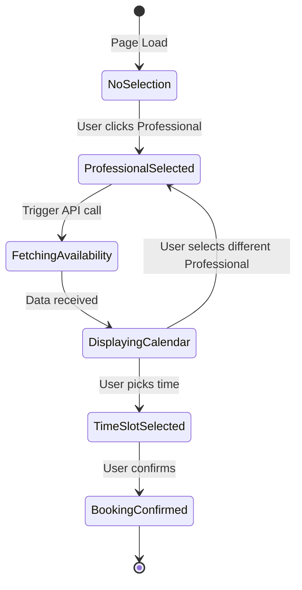
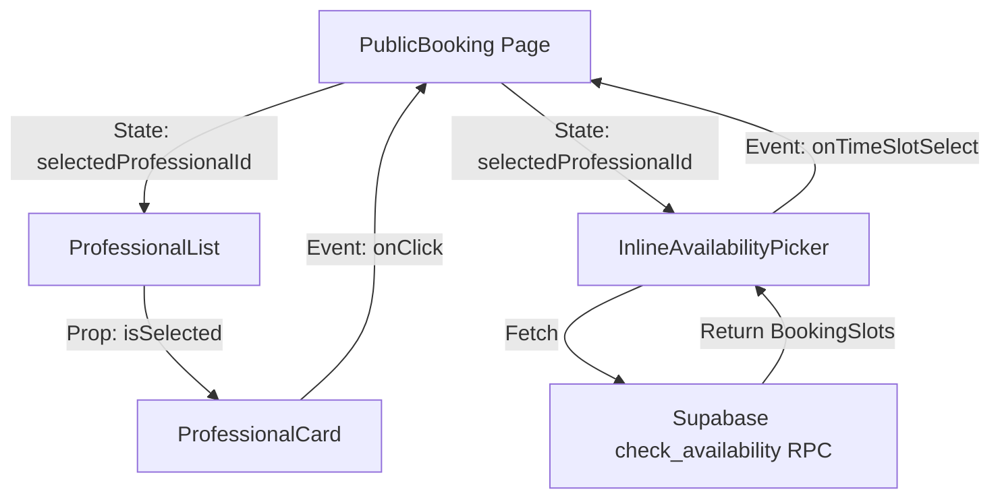

# Design Document: Unified Booking Flow

## Overview

The Unified Booking Flow redesigns the booking experience by eliminating the traditional multi-step wizard in favor of a single-page, context-aware interface. Users select a professional and immediately see their availability without page navigation, significantly reducing friction and time-to-booking.

## Architecture

### Interaction Model: Responsive Master-Detail Pattern

The system implements a responsive interaction model that adapts based on device size:

**Mobile (Accordion Pattern):**
- Vertical stack of `ProfessionalCard` components
- Tapping a card expands it accordion-style to reveal calendar
- Only one professional can be expanded at a time (auto-collapse others)
- Expanded area contains `<Calendar />` and `<TimeSlotGrid />`

**Desktop (Split View):**
- Left Panel: Vertical list of Professionals in compact view
- Right Panel: Large, persistent Calendar/Time view
- Clicking a professional updates the Right Panel content instantly
- Both panels remain visible simultaneously

### State Flow



## Components and Interfaces

### Modified Components

**`PublicBooking.tsx`**
- Remove wizard step logic (`currentStep` state)
- Implement responsive layout switching (accordion vs split view)
- Manage `selectedProfessionalId` and `selectedTimeSlot` state
- Use `useMediaQuery` hook to detect mobile vs desktop

**`ProfessionalCard.tsx`**
- Add `isSelected: boolean` prop for active state styling
- Add `onSelect: (id: string) => void` callback prop
- Add `expandedContent?: ReactNode` prop for mobile accordion content
- Apply neon green border/glow when `isSelected` is true

### New Components

**`InlineAvailabilityPicker.tsx`**
```typescript
interface InlineAvailabilityPickerProps {
  professionalId: string;
  selectedDate?: Date;
  onDateChange: (date: Date) => void;
  onTimeSlotSelect: (slot: BookingSlot) => void;
}
```

Responsibilities:
- Fetch availability using Supabase `check_availability` RPC
- Render `Calendar` component for date selection
- Render `TimeSlotGrid` component for time selection
- Display skeleton loader during fetch
- Handle empty states (no slots available)

**`TimeSlotGrid.tsx`**
```typescript
interface TimeSlotGridProps {
  slots: BookingSlot[];
  selectedSlot?: BookingSlot;
  onSlotSelect: (slot: BookingSlot) => void;
}
```

Responsibilities:
- Display available time slots in a grid layout
- Highlight selected slot
- Disable unavailable slots

## Data Models

### BookingSlot
```typescript
interface BookingSlot {
  id: string;
  professionalId: string;
  startTime: Date;
  endTime: Date;
  isAvailable: boolean;
}
```

### BookingState
```typescript
interface BookingState {
  selectedProfessionalId: string | null;
  selectedDate: Date;
  selectedTimeSlot: BookingSlot | null;
  selectedServiceId: string | null;
}
```

## Data Flow



## Correctness Properties

*A property is a characteristic or behavior that should hold true across all valid executions of a system—essentially, a formal statement about what the system should do. Properties serve as the bridge between human-readable specifications and machine-verifiable correctness guarantees.*

### Property 1: State Integrity on Professional Switch

*For any* booking state with a selected time slot, when a different professional is selected, the previously selected time slot must be cleared to prevent booking mismatches.

**Validates: Requirements 4.3**

### Property 2: Layout Stability on Mobile Expansion

*For any* professional card that is clicked on mobile, expanding the card must keep the card header visible in the viewport without causing unexpected scroll jumps.

**Validates: Requirements 5.4**

### Property 3: Single Expansion on Mobile

*For any* mobile view with multiple professionals, when a professional is selected, all other expanded professionals must be collapsed automatically.

**Validates: Requirements 3.3**

### Property 4: Availability Fetch Consistency

*For any* professional selection, the availability data displayed must correspond exactly to the selected professional's ID.

**Validates: Requirements 4.2**

## Error Handling

### Network Errors
- Display user-friendly error message when availability fetch fails
- Provide retry button
- Log error details for debugging

### Empty States
- Show "No availability" message when professional has no slots
- Suggest alternative professionals or date ranges
- Maintain UI structure (don't collapse)

### Invalid State
- Prevent booking submission if required fields are missing
- Validate professional ID exists before fetching
- Handle race conditions when rapidly switching professionals

## Testing Strategy

### Unit Testing
- Test state management logic in `PublicBooking.tsx`
- Test `InlineAvailabilityPicker` with mocked API responses
- Test `ProfessionalCard` selection and expansion behavior
- Test responsive layout switching logic

### Property-Based Testing

We will use **fast-check** as the property-based testing library for TypeScript/React.

Configuration:
- Each property test must run a minimum of 100 iterations
- Each test must include a comment tag referencing the design document property

Property tests to implement:
1. **State Integrity Test**: Generate random booking states and professional switches, verify time slot is always cleared
2. **Layout Stability Test**: Generate random scroll positions and card expansions, verify card remains visible
3. **Single Expansion Test**: Generate sequences of professional selections, verify only one is expanded
4. **Fetch Consistency Test**: Generate random professional IDs and verify fetched data matches

### Integration Testing
- Test complete booking flow from professional selection to confirmation
- Test mobile vs desktop layout switching
- Test error recovery flows

## Visual Style (Design System Alignment)

### Selection State
- Selected professional cards: `ring-2 ring-primary` (Neon Green border)
- Hover state: `hover:ring-1 hover:ring-primary/50`
- Active glow effect using `shadow-[0_0_15px_rgba(0,255,0,0.3)]`

### Transitions
- Card expansion: Use `framer-motion` with `initial={{ height: 0 }}` and `animate={{ height: "auto" }}`
- Availability fade-in: `transition-opacity duration-300`
- Professional switch: Cross-fade between availability data

### Responsive Breakpoints
- Mobile: `< 768px` - Accordion pattern
- Desktop: `>= 768px` - Split view pattern
- Use `useMediaQuery` hook from `src/hooks/use-mobile.tsx`

### Loading States
- Skeleton loader: Use existing `Skeleton` component from `src/components/ui/skeleton.tsx`
- Pulse animation for loading cards
- Spinner for time slot grid loading
